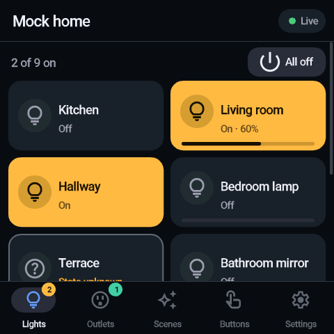
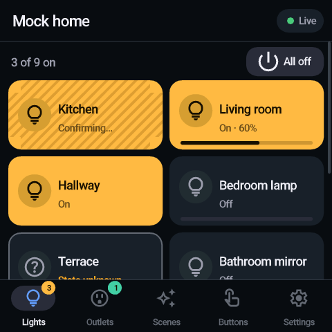
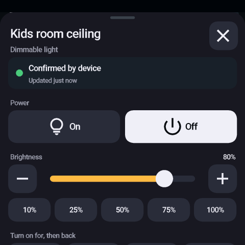
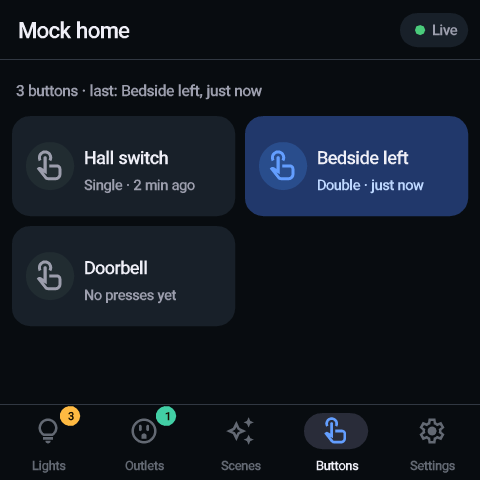
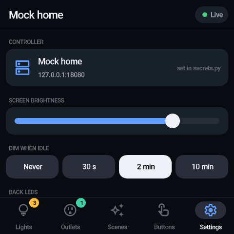
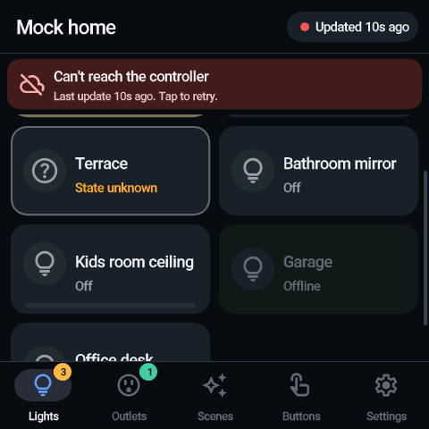
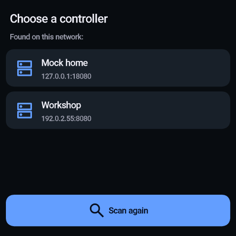

# swkit panel for Pimoroni Presto

A wall-panel UI for [swkit](../README.md) that runs on a
[Pimoroni Presto](https://github.com/pimoroni/presto): a 4" 480×480 touch
screen built around an RP2350 with Wi-Fi. It talks to swkit's control API
over the LAN. You can switch lights and outlets, dim, run timers and step
scenes, and the Buttons page shows wall-switch presses as they happen.

This folder is **not part of the swkit Go binary**. It is a MicroPython app
copied onto the Presto. The only related change on the swkit side is the
optional mDNS announcement described below.

| Lights | Pending command | Detail sheet | Buttons |
|---|---|---|---|
|  |  |  |  |

| Settings | Controller unreachable | Controller picker |
|---|---|---|
|  |  |  |

The screenshots come from the PC simulator (`sim/`). It runs the same code
and renders with the same font and the same fill rules as PicoVector.

## What it covers

It has the same scope and the same honesty rules as the web control UI
(`/control`, see `server/control_static/control.js`).

| Web control UI | Presto panel |
|---|---|
| Sections: Lights, Outlets, Scenes, Buttons | One page per section, as tabs at the bottom. Swipe left/right to change page. Pages scroll vertically, with momentum. |
| Tap to toggle; idempotent `set`, `toggle` only when the state is unknown | Same |
| Requested state shown hatched until a poll *started after* the acknowledgement confirms it; amber "Unconfirmed" after 6 s | Same; the state machine is a direct port (`src/model.py`) |
| Power and brightness as independent, serialized request slots | Same |
| `state_error` shown as unknown, never as off | Same ("?" icon, "State unknown") |
| Page greys out with a banner when polls stop | Header pill turns red, a banner shows the age of the data, and "on" tiles are muted |
| Long-press: detail sheet with On/Off, brightness, presets, "on/off for" timers, scene stepping, plain-language sync status | Same sheet, sized for fingers |
| Two-tap "All off" per section | Same |
| Button tiles show the last press and when it happened | Same; a fresh press lights the tile blue for 3 s, and optionally flashes the LEDs on the back |
| Display styles (tiles/list/compact), light/dark theme | Not applicable: one layout tuned for the 480×480 panel, dark theme |

Panel-only features:

- **Discovery.** It finds swkit on the LAN over mDNS. A picker appears if
  there is more than one controller. If the controller's IP changes, the
  panel finds it again by name.
- **Wall-panel behaviour.** The screen dims when idle; the first touch only
  wakes it and doesn't switch anything. After 5 minutes idle it returns to
  the first page. It reconnects to Wi-Fi by itself.
- **Back LEDs.** *Status* gives a blue flash on a button press and a slow
  red pulse while the controller is unreachable. *Glow* mirrors the screen
  colours.
- **Optional tap sound** from the piezo buzzer.
- **On-screen guidance** for every failure: missing `secrets.py`, wrong
  Wi-Fi password, no controller found, controller unreachable.

## Why MicroPython, not C++

Both were evaluated against
[pimoroni/presto](https://github.com/pimoroni/presto) (firmware v2.0.0) and
[presto-boilerplate](https://github.com/pimoroni/presto-boilerplate).

| | MicroPython (chosen) | C++ (pico-sdk, presto-boilerplate) |
|---|---|---|
| Drawing | PicoGraphics and PicoVector are C modules: anti-aliased vector text, shapes and blitting run natively. Python only decides *what* to draw. | Same libraries, called directly |
| Wi-Fi, HTTP, JSON | Built in: EzWiFi, asyncio streams, `json` | Raw lwIP and cyw43; HTTP client, JSON parsing and reconnects are yours to write |
| Touch, LEDs, buzzer | Frozen drivers (`presto.touch`, `set_led_rgb`, `Buzzer`) | No C++ touch driver in the repos; port it yourself |
| Boilerplate state | Official firmware, actively released (v2.0.0, Aug 2026) | Last updated Dec 2024; quits with a blank screen if there's no SD card |
| Iteration | Copy `.py` files over USB, REPL for debugging | Rebuild and reflash a `.uf2` on every change |
| What C++ would add | Raw speed for full-frame animation, LVGL (no Presto port exists) | |

The panel redraws only what changed. A tap repaints one tile; a poll with no
changes repaints nothing. Interpreter overhead is therefore small next to
the native drawing. And since the device is always powered, idle power
draw doesn't matter. The app also checks its own frame time:
*Settings → Last frame*.

**Capability differences on this hardware**

- Rotation is limited to 0° and 180° (ST7701 scan-out).
- Touch is capacitive, two points, but two fingers side by side on the same
  row register badly. The UI uses only single-finger gestures.
- MicroPython has no mDNS service browser. `src/mdns.py` sends a DNS-SD
  "legacy unicast" query (RFC 6762 §6.7), which swkit's responder answers
  directly. Tested against swkit's real responder.
- There is no push channel: the panel polls the control API every 2 s, and
  every 0.5 s while a command is waiting to be confirmed. The web UI does
  the same.

## 1. Prepare swkit

Enable the control API in swkit's `config.json` and let it announce itself:

```json
"WebServer": { "Enabled": true, "Port": 8080 },
"ControlServer": { "Enabled": true, "Advertise": true }
```

`Advertise` publishes `_swkit._tcp` over mDNS, carrying the port and the API
path (`path=/control`). It is off by default. Without it, set `SWKIT_URL`
on the panel instead (step 3).

> The control API has no authentication, the same as the `/control` web
> page. Anyone on the LAN who can reach the port can switch your devices.

## 2. Flash the Presto firmware (once)

1. Download `presto-v2.0.0-micropython.uf2` (or newer) from
   https://github.com/pimoroni/presto/releases/latest. The plain image
   keeps your files. The `-with-filesystem` variant erases them and
   installs Pimoroni's launcher and demos.
2. Connect the Presto over USB-C. Hold **BOOT**, tap **RESET**, and release
   BOOT. A drive called `RP2350` appears.
3. Copy the `.uf2` onto the drive. The Presto reboots by itself.

## 3. Wi-Fi and (optionally) the controller address

```sh
cp src/secrets.example.py src/secrets.py
$EDITOR src/secrets.py
```

```python
WIFI_SSID = "your-network"
WIFI_PASSWORD = "your-password"
SWKIT_URL = ""   # e.g. "http://192.168.1.20:8080/control" to skip discovery
```

`src/secrets.py` is git-ignored. The Presto only has 2.4 GHz Wi-Fi.

## 4. Upload the app

The deploy script uses [mpremote](https://docs.micropython.org/en/latest/reference/mpremote.html):

```sh
pip install mpremote
./deploy.sh                # installs and reboots; the panel starts on boot
```

Options:

```sh
./deploy.sh --launcher     # install as /swkit.py and keep Pimoroni's launcher
                           # (needs the -with-filesystem firmware)
./deploy.sh --mpy          # precompile to .mpy (pip install mpy-cross; same
                           # MicroPython version as the firmware, 1.29 for v2.0.0)
PORT=/dev/ttyACM0 ./deploy.sh   # pick the device when several are connected
DRY_RUN=1 ./deploy.sh      # print the mpremote command without running it
```

What ends up on the Presto:

```
/main.py            entry point (or /swkit.py with --launcher)
/secrets.py         Wi-Fi + optional SWKIT_URL (copied only if src/secrets.py exists)
/swkit/*.py         the app
/swkit/swkit.af     font with icons
/swkit_settings.json   created on the device: chosen controller, brightness, ...
```

**Without mpremote**, use [Thonny](https://thonny.org): pick the Presto's
serial port as a MicroPython interpreter, then use the Files pane. Create a `swkit`
folder on the device and copy everything from `src/` into it, except
`main.py` and the secrets files. Add `assets/swkit.af` to the same folder.
Then copy `src/main.py` and your `secrets.py` to the device root.

**First boot**

1. The panel joins Wi-Fi.
2. It looks for controllers. With exactly one, it connects straight away.
   With several, it shows a picker.
3. It remembers the choice. Use *Settings → Change* to pick another.

To get the Pimoroni launcher back, delete `/main.py` (for example
`mpremote rm :/main.py`) and flash the `-with-filesystem` firmware again.
Note that this erases all files.

## Using it

- **Tap** a tile to switch it. A hatched tile is still waiting for the
  device to report the new state.
- **Long-press** a tile for details: explicit On/Off, brightness slider with
  − / + and presets, "on for 5 min" style timers, scene stepping, and the
  sync status in words.
- **Swipe** sideways or use the tabs to change page. Drag up and down to
  scroll. Tab badges count what's on.
- **Tap the status pill** (top right) or the red banner to refresh now.
- **All off** asks for a second tap within 3 s.

| Tile look | Meaning |
|---|---|
| Bright fill (amber lights, teal outlets, violet scenes) | On, confirmed by the device |
| Diagonal stripes, "Turning on…" / "Confirming…" | Command sent; the device hasn't reported the new state yet |
| Amber outline, "Unconfirmed" | The device didn't confirm within 6 s; the tile shows what it reports |
| "?" icon, "State unknown" | swkit couldn't read the device; a tap sends a toggle |
| Dimmed, "Offline" | swkit can't reach the device; taps are ignored |
| Blue (Buttons page) | Pressed in the last 3 seconds |
| White outline flash | Just confirmed |

On the Presto, *Settings* holds screen brightness, *Dim when idle*, back
LEDs (Off / Status / Glow) and tap sound. It also shows Wi-Fi, IP and the
panel's name. The panel announces itself as `swkit-panel.local`.

## Development

```
presto/
  src/          the app (copied to /swkit on the device)
    app.py      boot, Wi-Fi, discovery, polling, LEDs, dimming
    ui.py       layout, rendering, gestures, pages, sheet, settings
    model.py    device state + command/confirmation state machine
    gfx.py      PicoGraphics/PicoVector helpers (text fitting, icons)
    mdns.py     DNS-SD browser (legacy unicast)
    ahttp.py    non-blocking HTTP/1.0 client on asyncio streams
    api.py      control API client
    settings.py persisted panel settings
  assets/       swkit.af font (+ licence notice)
  tools/        make_font.py: rebuilds swkit.af
  sim/          PC simulator, MicroPython check, tests, mock controller
  deploy.sh     upload with mpremote
```

### PC simulator

The simulator runs the unmodified `src/` against fake hardware modules
(`sim/fake/`) and a mock controller. The mock acknowledges commands at
once but reports the new state up to 1.6 s later, like Shelly over MQTT. It
also has an unreadable device, an offline device and button presses.

```sh
pip install pillow numpy
python3 sim/run.py              # scripted tour -> sim/out/*.png
python3 sim/run.py --discover   # controller picker
python3 sim/mock_swkit.py       # just the mock control API on :8080
```

The fakes check arguments the way the C bindings do. For example,
`PicoVector.text()` rejects float coordinates, as the real binding does.

### MicroPython checks

```sh
# unit tests for the state machine (CPython and MicroPython)
python3 sim/test_model.py
MICROPYPATH=.frozen:src micropython sim/test_model.py

# whole app, headless, on the MicroPython unix port, tapping through every screen
python3 sim/mock_swkit.py --port 18081 &
sh sim/mp_check.sh
```

### Font

`assets/swkit.af` contains Roboto Medium (Latin, including Polish) and the
Material Symbols icons the UI uses. To add an icon:

1. Add it to `ICONS` in `tools/make_font.py` and to `ICON` in `src/gfx.py`.
2. Run:

```sh
pip install freetype-py
python3 tools/make_font.py
```

## Troubleshooting

- **"Looking for swkit" finds nothing.** Check that `ControlServer.Advertise`
  is on and swkit was restarted. Some access points filter multicast or
  isolate Wi-Fi clients. In that case set `SWKIT_URL` in `secrets.py`.
- **"Can't join" Wi-Fi.** The Presto supports 2.4 GHz only. Also check the
  SSID and password in `secrets.py`.
- **Blank screen or a message about `swkit.af`.** Re-run `./deploy.sh`; the
  font must be at `/swkit/swkit.af`.
- **Logs and REPL.** Run `mpremote repl` to see the app's prints and any
  traceback. Ctrl-C stops the app; Ctrl-D soft-reboots. After a crash the
  panel shows the error and restarts after 20 seconds.

## Status

The app was developed with the PC simulator, the MicroPython unix port
(1.22) and swkit's real mDNS responder. It has **not yet been run on
physical Presto hardware**. In particular, frame times on the RP2350 are
unmeasured; check *Settings → Last frame* on the device.
